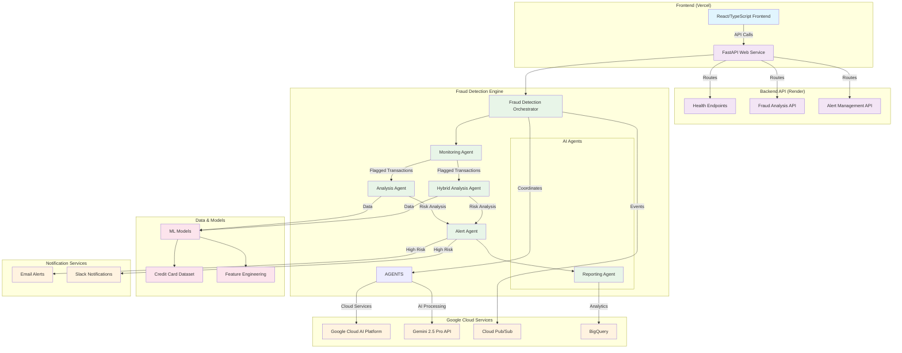
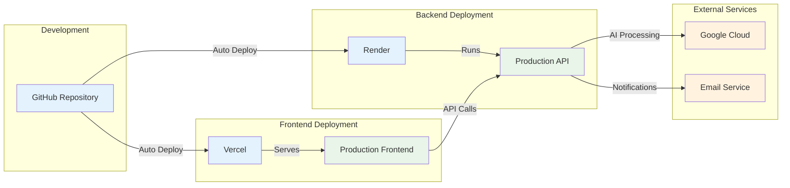

# A2A Financial Fraud Detection System - Architecture

## System Overview

The A2A Financial Fraud Detection System is a comprehensive, cloud-native application that uses AI agents and machine learning to detect fraudulent transactions in real-time.

## Architecture Diagram

## Component Details

### Frontend Layer (Vercel)
- **Technology**: React with TypeScript, Vite build system
- **Features**: 
  - Real-time transaction analysis interface
  - Agent workflow visualization
  - Dashboard with charts and metrics
  - Alert management interface
- **Deployment**: Vercel with automatic GitHub integration

### Backend API (Render)
- **Technology**: FastAPI with Python 3.11
- **Endpoints**:
  - `/api/v1/analyze` - Single transaction analysis
  - `/api/v1/analyze/bulk` - Batch transaction processing
  - `/api/v1/alerts` - Alert management
  - `/health` - Health monitoring
- **Features**: CORS support, request logging, background tasks

### Fraud Detection Engine

#### Orchestrator
- **Role**: Coordinates all AI agents and manages system lifecycle
- **Features**: Agent health monitoring, graceful shutdown, system statistics

#### AI Agents
1. **Monitoring Agent**: Continuous transaction monitoring and flagging
2. **Analysis Agent**: Standard fraud analysis using ML models
3. **Hybrid Analysis Agent**: Advanced analysis combining multiple techniques
4. **Alert Agent**: Manages and dispatches fraud alerts
5. **Reporting Agent**: Generates analytics and reports

### Data Layer
- **ML Models**: Keras-based fraud detection models
- **Dataset**: Credit card transaction dataset with anonymized features
- **Feature Engineering**: Real-time feature extraction and normalization

### External Integrations

#### Google Cloud Services
- **Gemini 2.5 Pro**: AI-powered transaction analysis
- **Cloud Pub/Sub**: Event streaming and messaging
- **BigQuery**: Analytics and data warehousing
- **AI Platform**: Model serving and inference

#### Notification Services
- **Email Alerts**: SMTP-based email notifications for high-risk transactions
- **Slack Integration**: Real-time Slack notifications (configurable)

## Data Flow

1. **Transaction Input**: User submits transaction through frontend
2. **API Processing**: FastAPI receives and validates transaction data
3. **Orchestration**: Orchestrator coordinates agent workflow
4. **Monitoring**: Transaction is evaluated for risk indicators
5. **Analysis**: Flagged transactions undergo detailed AI analysis
6. **Risk Assessment**: ML models and AI provide risk scores
7. **Alert Generation**: High-risk transactions trigger alerts
8. **Notification**: Alerts sent via email/Slack
9. **Reporting**: Results stored for analytics and reporting

## Security Features

- Environment variable management for API keys
- CORS configuration for cross-origin requests
- Request logging and monitoring
- Secure credential handling in deployment

## Deployment Architecture

## Key Technologies

- **Frontend**: React, TypeScript, Vite, Tailwind CSS, Recharts
- **Backend**: FastAPI, Python 3.11, Uvicorn, Pydantic
- **AI/ML**: Google Gemini API, TensorFlow/Keras, Scikit-learn
- **Cloud**: Google Cloud Platform, Vercel, Render
- **Data**: Pandas, NumPy, Matplotlib, Seaborn
- **DevOps**: Docker, GitHub Actions, Environment Variables

## Environment Configuration

- **Development**: Local development with `.env.local`
- **Production**: Environment variables managed through deployment platforms
- **Security**: API keys and secrets managed as environment variables
- **Monitoring**: Health checks and logging across all components