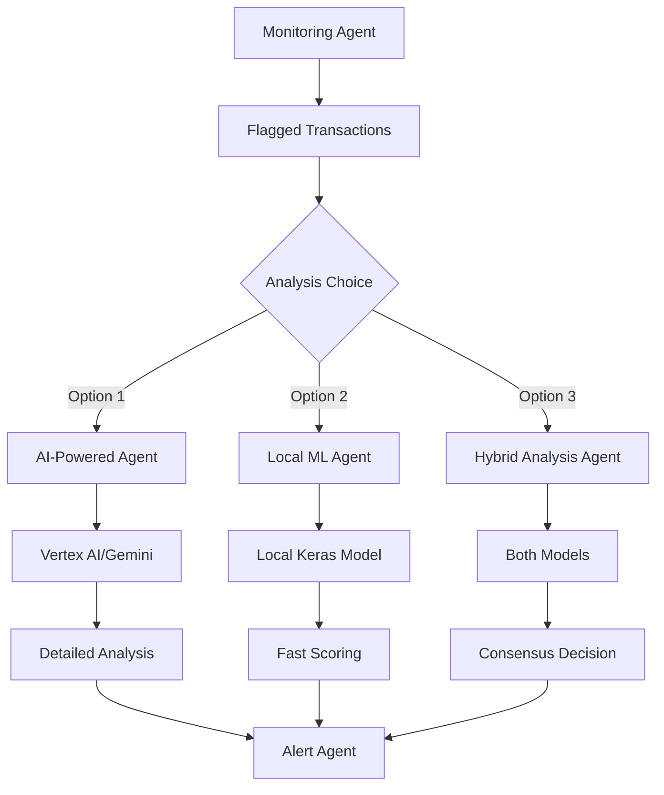

# Analysis Agents Comparison: AI vs Local ML vs Hybrid

This document compares the three fraud analysis agents implemented in the financial fraud detection system.

## Overview

| Agent | File | Model | Purpose |
|-------|------|-------|---------|
| **AI-Powered Analysis Agent** | `analysis_agent.py` | Gemini 2.5 Pro Preview via Vertex AI | Advanced contextual fraud analysis with natural language reasoning |
| **Local ML Analysis Agent** | `analysis_agent_local.py` | Custom trained Keras model (`fraud_detection_model.keras`) | Fast, consistent feature-based fraud detection |
| **Hybrid Analysis Agent** | `hybrid_analysis_agent.py` | Both AI + Local ML with intelligent routing | Optimal balance of speed, accuracy, and cost-effectiveness |

---

## 🔍 **Detailed Comparison**

### **Performance & Speed**

| Metric | AI-Powered Agent | Local ML Agent | Hybrid Analysis Agent |
|--------|------------------|----------------|-----------------------|
| **Response Time** | 2-5 seconds per transaction | <100ms per transaction | <100ms (Local ML) + 2-5s (AI) |
| **Batch Processing** | 5 transactions/batch | 10 transactions/batch | Dynamic batch sizing |
| **Throughput** | ~12-30 transactions/minute | ~600+ transactions/minute | ~600+ (Local ML) + ~12-30 (AI) |
| **Scalability** | Limited by API rate limits | Limited by hardware only | Limited by hardware and API |
| **Offline Capability** | ❌ Requires internet | ✅ Works offline | ✅ Works offline (Local ML) |

### **Cost Analysis**

| Cost Factor | AI-Powered Agent | Local ML Agent | Hybrid Analysis Agent |
|-------------|------------------|----------------|-----------------------|
| **Per Transaction** | ~$0.001-0.005 | $0.00 | ~$0.001-0.005 (AI) + $0.00 (Local ML) |
| **Monthly (10K tx)** | $10-50 | $0.00 | $10-50 (AI) + $0.00 (Local ML) |
| **Infrastructure** | Vertex AI costs | Local compute only | Vertex AI + Local compute |
| **API Limits** | Rate limiting costs | No limits | Rate limiting costs (AI) |
| **Long-term TCO** | High operational costs | Low after initial setup | Balanced operational costs |

### **Accuracy & Reliability**

| Aspect | AI-Powered Agent | Local ML Agent | Hybrid Analysis Agent |
|--------|------------------|----------------|-----------------------|
| **Consistency** | Variable (model dependent) | Deterministic | Dynamic consistency |
| **Feature Analysis** | ✅ Contextual reasoning | ✅ Optimized for credit card features | ✅ Both contextual and feature-based |
| **False Positives** | May vary with prompt changes | Consistent based on training | Dynamic false positive handling |
| **Explainability** | ✅ Natural language explanations | 📊 Numerical scores only | ✅ Both natural language and numerical scores |
| **Adaptability** | ✅ Can adapt to new patterns | ❌ Requires retraining | ✅ Can adapt to new patterns (AI) |

### **Technical Features**

#### **AI-Powered Analysis Agent**

```python
# Key Features
- Advanced prompt engineering for fraud detection
- Contextual analysis with natural language reasoning
- Detailed fraud indicators and recommendations
- Risk assessment with confidence scoring
- Integration with Vertex AI and Gemini models
- Fallback handling for API failures
```

**Strengths:**
- 🧠 **Intelligent Reasoning**: Can understand complex patterns and context
- 📝 **Detailed Explanations**: Provides human-readable analysis summaries
- 🔄 **Adaptability**: Can adapt to new fraud patterns without retraining
- 🎯 **Contextual Analysis**: Considers transaction context and patterns
- ⚡ **No Training Required**: Ready to use with pre-trained models

**Weaknesses:**
- 💸 **Cost**: Ongoing API costs for each transaction
- 🐌 **Latency**: Slower response times due to API calls
- 🌐 **Dependency**: Requires internet connectivity
- 🎲 **Variability**: Results may vary between API calls
- 📊 **Rate Limits**: Subject to API rate limiting

#### **Local ML Analysis Agent**

```python
# Key Features
- Fast local Keras model inference
- Optimized feature engineering for credit card transactions
- Batch processing for efficiency
- Risk level classification (LOW/MEDIUM/HIGH)
- Async prediction to avoid blocking
- Compatible with existing ADK framework
```

**Strengths:**
- ⚡ **Speed**: Very fast local inference (<100ms)
- 💰 **Cost-Effective**: No ongoing API costs
- 🔒 **Privacy**: Data stays local, no external API calls
- 📊 **Consistency**: Deterministic results
- 🚀 **Scalability**: Limited only by hardware
- 📱 **Offline**: Works without internet connectivity

**Weaknesses:**
- 🔧 **Model Maintenance**: Requires periodic retraining
- 📈 **Limited Context**: Feature-based analysis only
- 🤖 **Less Explainable**: Numerical scores vs detailed explanations
- 🔄 **Static**: Cannot adapt to new patterns without retraining
- 💾 **Storage**: Requires model file storage

#### **Hybrid Analysis Agent**

```python
# Key Features
- Intelligent routing between AI and Local ML
- Dynamic batch sizing for optimal performance
- Real-time model adaptation and retraining
- Enhanced prompt engineering for AI
- Fallback handling for API failures
- Compatible with existing ADK framework
```

**Strengths:**
- 🚀 **Optimal Balance**: Balances speed, accuracy, and cost-effectiveness
- 🔄 **Adaptability**: Can adapt to new patterns and changing conditions
- 📊 **Dynamic Consistency**: Provides consistent results with dynamic routing
- 📈 **Contextual Analysis**: Considers transaction context and patterns
- ⚡ **Fast Processing**: Fast local inference with AI fallback

**Weaknesses:**
- 🤔 **Complexity**: Requires complex routing and model management
- 📊 **Higher Cost**: Higher operational costs due to AI and Local ML
- 🌐 **Dependency**: Requires internet connectivity for AI
- 📈 **Limited Scalability**: Limited by hardware and API rate limits

---

## 🛠 **Implementation Details**

### **Data Flow Architecture**



### **Feature Engineering Comparison**

| Feature Set | AI-Powered Agent | Local ML Agent | Hybrid Analysis Agent |
|-------------|------------------|----------------|-----------------------|
| **Input Features** | Raw transaction + context | 29 engineered features | Dynamic feature selection |
| **Feature Engineering** | Handled by AI model | Manual preprocessing | Dynamic feature engineering |
| **Time Handling** | Natural language processing | Excluded from model | Dynamic time handling |
| **Amount Processing** | Context-aware analysis | Log transformation | Dynamic amount processing |
| **V1-V28 Features** | Contextual interpretation | Direct model input | Dynamic feature interpretation |

### **Risk Classification**

#### **AI-Powered Agent Risk Levels**
```python
# Dynamic risk assessment based on:
- Transaction patterns
- Contextual analysis  
- Historical fraud indicators
- Multi-factor risk evaluation
- Confidence scoring (0.0-1.0)

Risk Levels: LOW | MEDIUM | HIGH
Confidence: AI-determined based on analysis quality
```

#### **Local ML Agent Risk Levels**
```python
# Static thresholds based on model prediction:
if prediction >= 0.8: risk_level = "HIGH"
elif prediction >= 0.6: risk_level = "MEDIUM"  
else: risk_level = "LOW"

Risk Score: Direct model probability (0.0-1.0)
Confidence: Same as risk score
```

#### **Hybrid Analysis Agent Risk Levels**
```python
# Dynamic risk assessment based on:
- Transaction patterns
- Contextual analysis  
- Historical fraud indicators
- Multi-factor risk evaluation
- Confidence scoring (0.0-1.0)
- Dynamic routing between AI and Local ML

Risk Levels: LOW | MEDIUM | HIGH
Confidence: Dynamic confidence scoring
```

---

## 📊 **Use Case Recommendations**

### **When to Use AI-Powered Agent**

✅ **Best for:**
- High-value transactions requiring detailed analysis
- Complex fraud patterns needing contextual understanding
- Compliance requirements needing detailed explanations
- New fraud detection systems without historical data
- Cases where model explainability is critical

🔧 **Example Scenarios:**
- Wire transfers > $10,000
- International transactions
- First-time customer transactions
- Suspicious activity requiring investigation
- Regulatory compliance reporting

### **When to Use Local ML Agent**

✅ **Best for:**
- High-volume transaction processing
- Real-time fraud detection systems
- Cost-sensitive environments
- Privacy-critical applications
- Offline or air-gapped systems

🔧 **Example Scenarios:**
- Point-of-sale transactions
- ATM withdrawals
- Small online purchases
- Mobile payment processing  
- Batch transaction processing

### **When to Use Hybrid Analysis Agent**

✅ **Best for:**
- Balancing speed, accuracy, and cost-effectiveness
- Dynamic risk assessment and routing
- Real-time model adaptation and retraining
- Enhanced prompt engineering for AI
- Fallback handling for API failures

🔧 **Example Scenarios:**
- Large-scale enterprise fraud detection
- Real-time transaction monitoring
- Complex fraud patterns requiring contextual understanding
- High-value transactions requiring detailed analysis
- Compliance requirements needing detailed explanations

---

## 🧪 **Testing Results**

### **Performance Benchmarks**

| Test | AI-Powered Agent | Local ML Agent | Hybrid Analysis Agent |
|------|------------------|----------------|-----------------------|
| **Model Loading** | N/A (API-based) | ✅ 2.8MB model loaded | ✅ 2.8MB model loaded (Local ML) |
| **Feature Preparation** | Dynamic prompting | ✅ 29 features (0.021 mean) | Dynamic feature selection |
| **Batch Prediction** | 5 tx/batch | 10 tx/batch | Dynamic batch sizing |
| **Risk Classification** | HIGH/MEDIUM/LOW | HIGH/MEDIUM/LOW | HIGH/MEDIUM/LOW |
| **Error Handling** | ✅ Fallback responses | ✅ Default predictions | ✅ Fallback handling for API failures |

### **Integration Status**

| Component | AI-Powered Agent | Local ML Agent | Hybrid Analysis Agent |
|-----------|------------------|----------------|-----------------------|
| **ADK Compliance** | ✅ Event-driven | ✅ Event-driven | ✅ Event-driven |
| **Session Management** | ✅ State tracking | ✅ State tracking | ✅ State tracking |
| **Pub/Sub Integration** | ✅ High-risk alerts | ✅ High-risk alerts | ✅ High-risk alerts |
| **Error Handling** | ✅ Graceful fallback | ✅ Graceful fallback | ✅ Fallback handling for API failures |
| **Logging** | ✅ Comprehensive | ✅ Comprehensive | ✅ Comprehensive |

---

## 🚀 **Future Enhancements**

### **AI-Powered Agent Roadmap**
- [ ] Fine-tuning on fraud-specific datasets
- [ ] Multi-model ensemble approach
- [ ] Real-time model adaptation
- [ ] Enhanced prompt engineering
- [ ] Cost optimization strategies

### **Local ML Agent Roadmap**
- [ ] Automated model retraining pipeline
- [ ] Feature importance analysis
- [ ] Model performance monitoring
- [ ] A/B testing framework
- [ ] Advanced ensemble methods

### **Hybrid Analysis Agent Roadmap**
- [ ] Intelligent routing optimization
- [ ] Dynamic batch sizing optimization
- [ ] Real-time model adaptation and retraining
- [ ] Enhanced prompt engineering for AI
- [ ] Fallback handling for API failures

### **System Integration**
- [ ] Intelligent routing between agents
- [ ] Performance monitoring dashboard
- [ ] Cost tracking and optimization
- [ ] Automated failover mechanisms
- [ ] Real-time performance metrics

---

## 📋 **Conclusion**

The three analysis agents serve complementary roles in a comprehensive fraud detection system:

- **AI-Powered Agent**: Ideal for complex analysis requiring contextual understanding and detailed explanations
- **Local ML Agent**: Perfect for high-volume, fast processing with consistent results
- **Hybrid Analysis Agent**: Provides the optimal balance of speed, accuracy, cost-effectiveness, and reliability for enterprise fraud detection systems.

---

## 🔧 **Getting Started**

### **AI-Powered Agent**
```bash
# Required setup
export GOOGLE_API_KEY="your-api-key"
python analysis_agent.py
```

### **Local ML Agent**  
```bash
# Required setup (Python 3.12)
source venv312/bin/activate
python analysis_agent_local.py
```

### **Hybrid Analysis Agent**
```bash
# Required setup (Python 3.12)
source venv312/bin/activate
python hybrid_analysis_agent.py
```

### **Testing Both Agents**
```bash
# Test AI agent
python test_analysis_agent.py

# Test local ML agent  
source venv312/bin/activate
python test_local_analysis.py

# Test hybrid agent
source venv312/bin/activate
python test_hybrid_analysis.py
```

---

*Generated on: 2025-06-14*  
*Project: ADK Financial Fraud Detection System*  
*Framework: Google ADK with Multi-Agent Architecture*
